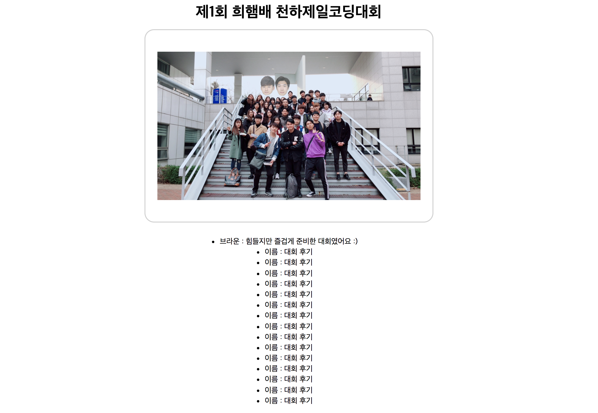

# #10 추억 남기기

희햄은 오늘의 추억을 간직하고 싶습니다. 그래서 개발자인 여러분에게 외주를 부탁드리려고 합니다. 아래와 같이 단체사진을 액자 속에 넣은 후 간단한 후기를 작성해주세요.

---

***팀당 대표로 1명만 정답을 제출하면 됩니다. 팀원끼리 열심히 상의해서 문제를 해결해주세요.***

1. **Clone or download** 라는 녹색 버튼을 찾아서 이 프로젝트를 컴퓨터에 다운받습니다.

2. `final_project` 라는 새로운 폴더를 따로 만듭니다.(다운받은 폴더 내에 만들면 안됩니다.) 그리고 `final_project` 폴더로 방금 `1`에서 다운받은 `index.html` 과 `style.css` 파일을 옮겨줍니다.

3. VS Code로 프로젝트 내의 `index.html` 과 `style.css` 파일을 엽니다.

4. 희햄은 대부분의 코드를 미리 작성해놓았습니다. 부연설명도 주석 `<-- 주석 내용 -->` 안에 추가해놓았습니다. 수단과 방법을 가리지말고 오늘의 추억을 액자 정가운데에 위치시켜주세요.

5. 오늘 대회의 후기도 간략히 모든 사람이 빠짐없이 작성해주세요.

6. 사진과 후기를 모두 완성했다면 파일을 모두 저장합니다.

7. 팀 대표의 개인 GitHub Repository(**NEXT-LIKELION 아님에 유의**)에 `final` 이라는 새로운 저장소를 만듭니다.

8. 배웠던 Git & GitHub 내용을 바탕으로 `final` 저장소에 프로젝트를 올립니다.

9. GitHub Repository의 최종 형태는 `https://github.com/대표의GitHub아이디/final` 가 됩니다. 이 주소를 희햄에게 보내주세요. 결과물이 확인되면 방에서 탈출하실 수 있습니다.
